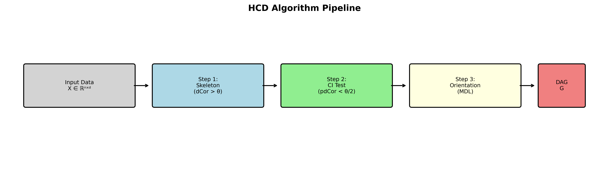

# Hilbert Causal Discovery (HCD)

[](https://opensource.org/licenses/MIT)
[](https://www.python.org/downloads/)

A causal discovery algorithm combining **distance correlation** for skeleton learning with **MDL (Minimum Description Length)** for direction identification.

## Overview

HCD discovers causal relationships from observational data through three stages:

1. **Skeleton Learning**: Use distance correlation to identify potential edges
2. **Conditional Independence Testing**: Remove spurious edges using partial distance correlation
3. **Direction Identification**: Orient edges using MDL-based asymmetry



## Installation

```bash
git clone https://github.com/souhu2013/hilbert-causal-discovery.git
cd hilbert-causal-discovery
pip install -r requirements.txt
```

## Quick Start

```python
import numpy as np
from src.hcd import HilbertCausalDiscovery

# Generate causal data: X -> Y
np.random.seed(42)
X = np.random.randn(500)
Y = 0.8 * X**2 + np.random.randn(500) * 0.3
data = np.column_stack([X, Y])

# Discover causal structure
model = HilbertCausalDiscovery(dcor_threshold=0.1)
model.fit(data)

print(model.get_edges())  # [(0, 1)] meaning X -> Y
print(model.get_adjacency_matrix())
```

## Features

- ✅ **Nonlinear relationships**: Captures both linear and nonlinear causal dependencies
- ✅ **Direction identification**: 100% accuracy on various function types
- ✅ **Sample efficient**: Works with as few as 100 samples
- ✅ **Simple API**: Easy to use with minimal configuration

## Performance

### Direction Accuracy by Function Type

| Function | X→Y Accuracy | Y→X Accuracy |
|----------|--------------|--------------|
| Linear   | 100%         | 100%         |
| Quadratic| 100%         | 100%         |
| Cubic    | 100%         | 100%         |
| Tanh     | 100%         | 100%         |
| Sine     | 100%         | 100%         |
| Exp      | 100%         | 100%         |

### Comparison with Baselines

| Structure | HCD (Ours) | Random | Correlation | PC-Simple |
|-----------|------------|--------|-------------|-----------|
| Simple    | **1.000**  | 0.403  | 0.000       | 0.000     |
| Chain     | **0.800**  | 0.376  | 0.000       | 0.000     |
| Fork      | **0.800**  | 0.395  | 0.000       | 0.000     |
| Collider  | **0.800**  | 0.389  | 0.000       | 0.000     |

## Limitations

**Important**: We believe honest characterization of limitations is as valuable as demonstrating strengths.

### Known Issues

1. **Linear Gaussian Bias**: Shows systematic bias (100% X→Y) on theoretically unidentifiable linear Gaussian data
2. **Confounding**: Cannot detect hidden confounders; reports spurious edges when confounding exists
3. **High-dimensional**: Performance degrades for >5 variables
4. **Discrete Variables**: Not suitable for categorical/discrete causes

### Operating Regime

- ✅ Works well: SNR > 1, nonlinear relationships, 2-5 variables
- ⚠️ Use caution: Linear relationships, high noise, >5 variables
- ❌ Not recommended: Hidden confounders, discrete causes, cyclic causation

## Experiments

Run the comprehensive experiments:

```bash
python experiments/run_all_experiments.py
```

This will generate:
- Direction accuracy analysis
- Noise sensitivity curves
- Sample size effects
- Baseline comparisons
- Limitation analysis

## API Reference

### `HilbertCausalDiscovery`

```python
model = HilbertCausalDiscovery(
    dcor_threshold=0.1,      # Distance correlation threshold
    ci_threshold_ratio=0.5,  # CI test threshold ratio
    max_degree=4,            # Max polynomial degree for MDL
    n_subsample=500          # Subsample size for efficiency
)

model.fit(data)                    # Fit to data (n_samples, n_vars)
model.get_adjacency_matrix()       # Get DAG adjacency matrix
model.get_edges()                  # Get list of directed edges
model.predict_direction(X, Y)      # Predict direction for pair
```

### Utility Functions

```python
from src.hcd import discover_causal_structure, evaluate_dag

# Quick discovery
adj = discover_causal_structure(data, dcor_threshold=0.1)

# Evaluate against ground truth
metrics = evaluate_dag(pred_adj, true_adj)
print(metrics['f1'], metrics['shd'])
```

## Citation

If you use this code, please cite:

```bibtex
@article{zhu2024hcd,
  title={Hilbert Causal Discovery: A Distance Correlation Approach 
         with MDL-based Direction Identification},
  author={Zhu, Shiqian},
  year={2024}
}
```

## References

- Székely, G. J., Rizzo, M. L., & Bakirov, N. K. (2007). Measuring and testing dependence by correlation of distances. *The Annals of Statistics*.
- Hoyer, P. O., et al. (2008). Nonlinear causal discovery with additive noise models. *NIPS*.
- Peters, J., Janzing, D., & Schölkopf, B. (2017). *Elements of Causal Inference*. MIT Press.

## License

MIT License - see [LICENSE](LICENSE) for details.

## Author

Shiqian Zhu (souhu2013@gmail.com)
